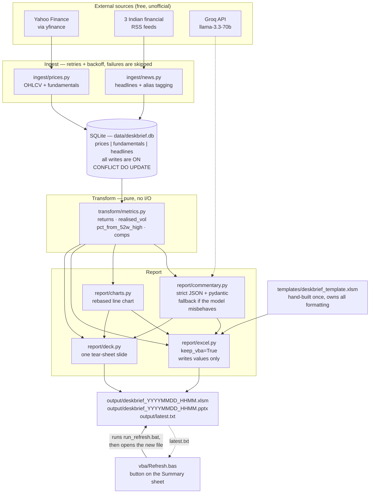
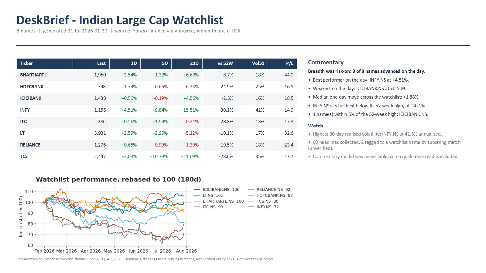
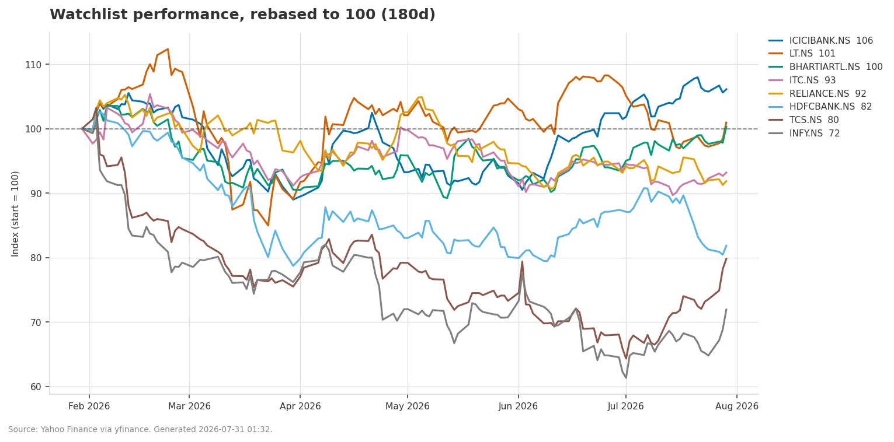

# DeskBrief

DeskBrief turns free, public market data into two artefacts an analyst can
actually open: a macro-enabled Excel workbook and a one-slide PowerPoint
tear-sheet. It pulls daily prices and fundamentals for eight Indian large caps
from Yahoo Finance and headlines from three Indian financial RSS feeds, stores
them idempotently in SQLite, computes returns, realised volatility and a comps
table, and writes the results into a template that a VBA button can refresh in
place. It exists because assembling that pack by hand every morning is twenty
minutes of copy-paste that a script should be doing.

**Status:** works end to end on Windows. The commentary stage currently runs its
deterministic fallback, because no Groq API key is configured on this machine.

---

## Architecture



The one structural decision worth calling out: **the Excel template owns every
piece of formatting, and Python only writes values.** openpyxl cannot create
VBA — it can only preserve a `vbaProject` that already exists in a file opened
with `keep_vba=True`. So the template is built by hand once, and the writer
never creates a sheet, sets a font, or applies a number format. Percentages are
written as raw fractions (`0.0254`) and the template's `0.00%` format renders
them.

---

## Screenshots

### Deck tear-sheet — real output


### Normalised price chart — real output


### Excel workbook — placeholder
> _TODO: screenshot of the Summary sheet with the Refresh DeskBrief button._
> This one needs the macro imported (setup step 7 below), so it has to be taken
> by hand after you build the template.

`docs/screenshots/summary_sheet.png`

### Excel Commentary sheet — placeholder
> _TODO: screenshot of the Commentary sheet._

`docs/screenshots/commentary_sheet.png`

---

## Setup

Requires **Python 3.11** and **Excel** (for the macro; the pipeline itself runs
without it).

```bash
py -3.11 -m venv .venv
.venv\Scripts\python.exe -m pip install -r requirements.txt
```

Copy the environment template and add a key if you want LLM commentary:

```bash
copy .env.example .env
```

`GROQ_API_KEY` is optional. Without it the pipeline still produces a complete
workbook and deck, using a deterministic summary computed from the comps table.

Create the schema:

```bash
.venv\Scripts\python.exe -m src.cli initdb
```

### One-time: build the Excel template

This step cannot be automated away. openpyxl cannot create a macro-enabled
workbook, so `templates/deskbrief_template.xlsm` has to be created in Excel
once. Print the exact click-path:

```bash
.venv\Scripts\python.exe -m src.cli template-help
```

It walks through eight steps: create the four sheets (`Summary`, `Charts`,
`Headlines`, `Commentary`), lay out and format the header rows, save as
`.xlsm`, import `vba/Refresh.bas` via the VBA editor, and attach a shape to the
`RefreshDeskBrief` macro.

There is an optional shortcut for the first half:

```bash
.venv\Scripts\python.exe tools\build_template.py
```

It creates the sheets and formatting through Excel COM. It also *attempts* the
`.bas` import, but Excel blocks programmatic access to the VBA project by
default, so **steps 6 and 7 — importing the macro and assigning the button —
are still manual.** A template committed to this repo already has the sheets
and formatting but no macro.

Check where you stand at any time:

```bash
.venv\Scripts\python.exe -m src.cli verify-template
```

Missing sheets are a hard failure. A missing macro is only a warning: the
workbook still builds, you just do not get the button.

---

## Running it

```bash
.venv\Scripts\python.exe -m src.cli refresh
```

Or double-click `run_refresh.bat`, which is also what the Excel button shells
out to. It appends to `logs/deskbrief.log` and exits with the real errorlevel.

Individual stages:

| Command | What it does |
| --- | --- |
| `initdb` | create the SQLite schema |
| `dbstats` | row counts per table |
| `ingest-prices` | yfinance OHLCV + fundamentals |
| `ingest-news` | RSS headlines + alias tagging |
| `ingest` | both of the above |
| `comps` | print the computed comps table |
| `report` | build the workbook and deck from the DB |
| `refresh` | ingest then report — the full pipeline |
| `template-help` | print the one-time template build steps |
| `verify-template` | check the template is usable |

`report` and `refresh` accept `--no-commentary`, `--no-chart` and `--no-deck`.

Tests:

```bash
.venv\Scripts\python.exe -m pytest
```

116 tests. The bulk of them cover `src/transform/metrics.py`, which is the only
layer with real business logic and is pure by contract — no database, no
network, no clock — so its tests need no fixtures.

---

## How the refresh button works

Excel holds an exclusive write lock on an open workbook, so the pipeline
**cannot** overwrite the file you are looking at. Rather than fight that:

1. Python writes a **new** `output/deskbrief_YYYYMMDD_HHMM.xlsm`.
2. It records that file's absolute path in `output/latest.txt`.
3. `RefreshDeskBrief` runs `run_refresh.bat`, waits for it, checks the exit
   code, reads `latest.txt`, opens the new workbook and closes the stale one.

Old outputs accumulate in `output/` and are not cleaned up automatically.

---

## Headline tagging is not NER

Headlines are matched to tickers by **case-insensitive substring matching
against a hand-maintained alias list** in `config/watchlist.yaml`. There is no
model and no entity disambiguation. Two guards keep the worst false positives
out — aliases match on word boundaries, so `ITC` does not fire inside `SWITCH`,
and the longest alias wins, so `HDFC Bank` beats bare `HDFC`.

It still gets things wrong, and the tests pin one such case deliberately:
a headline about **ICICI Prudential Life** is tagged to **ICICIBANK.NS**.
Different legal entity, shared brand prefix, and substring matching cannot tell
them apart. Treat the ticker column as a weak hint, not ground truth.

---

## Limitations and next steps

**SQLite is single-writer.** One writer at a time, full stop. WAL mode is on so
a reader does not block the writer, but two concurrent `refresh` runs will have
one of them fail on a locked database. Fine for one analyst on one machine;
not fine as a shared service. Postgres is the answer if this ever grows past
one desk.

**yfinance is an unofficial scraper and is rate-limited.** It reads Yahoo
Finance's undocumented endpoints, which change without notice — during this
build, the pinned `yfinance==0.2.51` returned non-JSON for every request and
produced zero rows until it was upgraded to `1.5.2`. `.info` in particular is
flaky and heavily throttled, so P/E, EV/EBITDA and sector are best-effort and
land as blanks when the request fails. There is no SLA here and there is no
licence to redistribute this data.

**Data quality is inherited, not verified.** Yahoo currently reports an
EV/EBITDA of ~1043x for INFY.NS, which is obviously wrong; it is displayed as
given. Banks legitimately have no EV/EBITDA and show blank. Multiples that are
zero or negative are blanked rather than ranked, but nothing else is sanity
checked.

**No corporate-action adjustment of our own.** Prices are stored as yfinance
returns them with `auto_adjust=True`, which back-adjusts for splits and
dividends. I verified this holds for a real case — HDFCBANK.NS split 2:1 on
2025-08-26 and the stored series is continuous through it — but the adjustment
is Yahoo's, not ours, and we do not check it. Mergers, spin-offs, ticker
changes and delistings are not handled at all. The stored `close` is therefore
not the price a broker printed that day.

**No scheduler.** Runs happen when you click the button or run the batch file.
There is no Task Scheduler entry, no cron, no retry-tomorrow-if-the-market-was
-shut logic. A Windows scheduled task calling `run_refresh.bat` would be the
obvious next step.

**The 52-week high is computed from the loaded window.** With the default
`history_period: 1y` that is genuinely 52 weeks, but shorten the window in
`config/watchlist.yaml` and the "52w high" silently becomes the high of
whatever you loaded.

**Headline recency is approximate.** Feeds report publication time in UTC and
it is stored naive; some entries carry no timestamp at all and sort last.

**Old outputs are never cleaned up.** Every run writes a new timestamped
workbook and deck. `output/` grows without bound.

**Not investment advice.** This is a data-plumbing exercise. Nothing here is a
recommendation, and the LLM commentary — when it runs — is a summarisation of
figures already in the table, not analysis.

### Next steps, roughly in order of value

1. A Windows scheduled task, plus a market-calendar check so it does not run on
   exchange holidays.
2. Replace substring tagging with a proper entity linker, or at minimum a
   negative-alias list to kill the `ICICI Prudential` class of false positive.
3. Retention on `output/`.
4. A second data source to cross-check Yahoo's fundamentals before they reach
   the sheet.
5. Postgres if more than one person ever runs this at once.

---

## Repo layout

```
config/watchlist.yaml     8 tickers, their aliases, and the RSS feeds
src/db.py                 SQLAlchemy Core schema + idempotent upsert
src/repository.py         read side: DB -> DataFrames
src/cli.py                every command
src/net.py                timeout + 3 retries + exponential backoff
src/ingest/prices.py      yfinance OHLCV and fundamentals
src/ingest/news.py        RSS + alias tagging (not NER)
src/transform/metrics.py  pure metrics — the tested core
src/report/excel.py       fills the .xlsm template, values only
src/report/commentary.py  Groq + pydantic + deterministic fallback
src/report/charts.py      matplotlib, two renders (sheet and slide)
src/report/deck.py        python-pptx, one slide
templates/                the hand-built .xlsm
vba/Refresh.bas           the macro behind the button
tools/build_template.py   optional COM bootstrapper
run_refresh.bat           what the button runs
```

`data/`, `output/`, `logs/` and `.env` are gitignored. Only `.env.example` is
committed.
